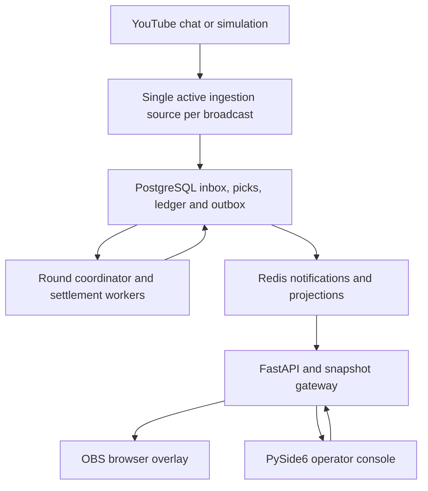
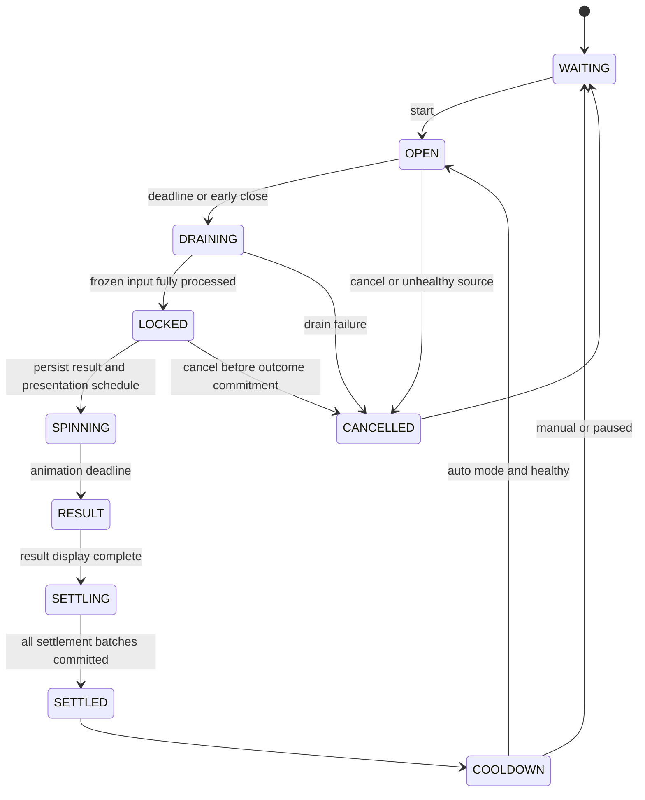

# YouTube Live Prediction Game — Master Specification

Version: 1.0 · Prepared: 2026-10-04 · Working product name: Color Rush Live

## 1. Purpose and authority

Build a YouTube livestream color-prediction game operated through a Windows PySide6 application and shown through an OBS browser-source overlay. Viewers participate through YouTube chat. The independent Python backend owns all rules, rounds, accepted picks, results, and scores.

This file is the implementation source of truth. Implement it through the five sequential prompts in `CURSOR_PROMPTS_YOUTUBE_LIVE_GAME.md`. The prompts are large implementation milestones, not permission to omit their internal steps. Read both files before starting. Keep a requirement-to-test matrix and progress log in the repository. Resolve ordinary implementation decisions independently; record decisions that affect contracts, fairness, storage, or operations.

The goal is a manageable modular monolith with a measured path toward hundreds of thousands of viewers. This is not a claim of already supporting that load. Watching YouTube does not create a connection to our backend; direct game traffic is delivered chat commands, a few operator clients, and a few OBS overlays. A future public companion website would introduce a separate fan-out workload.

## 2. Product rules and vocabulary

| Item | Required behavior |
| --- | --- |
| Choices | RED, GOLD, GREEN |
| Commands | `!red`, `!gold`, `!green`, `!score`, `!rank`, `!help` |
| Parsing | Trim whitespace, case-insensitive, exact command tokens; do not match ordinary sentences or arbitrary prefixes |
| Distribution | Red 47.5%, Green 47.5%, Gold 5%; use integer weights 475/475/50 totaling 1000 |
| Rewards | Correct Red +2, correct Green +2, correct Gold +14; incorrect pick +0 |
| Cost | Free participation; no point stake, purchased advantage, money, withdrawals, redeemable rewards, or negative points |
| Pick ownership | One final pick per player per round; subsequent eligible commands can change it |
| Change limit | Five actual color changes after the initial pick, per player per round; repeated same-color picks do not consume this allowance |
| Streak | Correct participating round increments streak; wrong participating round resets it; skipped/cancelled rounds leave it unchanged |
| Identity | Internal player UUID plus YouTube channel ID; never display name as the primary identity |
| Starting defaults | 30-second prediction window, up to 5-second processing drain, 6-second animation, 5-second result display, 3-second cooldown |
| Configuration | Validate and version it; probabilities/rewards/bonus settings are frozen when a round opens |
| Modes | Manual and automatic; simulation is clearly marked and isolated from production scores |

Use “Make your pick,” “Predictions open,” “Picks locked,” “Players,” “Points earned,” and “Recent results.” Never use betting language or financial multipliers in game interfaces. Wrong picks do not lose existing points. UI bonus wording is “Double Points” and “Gold Bonus.”

V1 bonuses: next-round Double Points multiplies all correct rewards by 2; next-round Gold Bonus changes the correct Gold reward to a configured integer (default 28). Only one bonus applies to a round. Both must be declared before opening and included in the immutable rules snapshot. No mid-round changes. Default distribution remains unchanged.

## 3. Scope: complete V1 and extension boundaries

### Ship in V1

- Independent backend, database migrations, background processes, secure operator API, simulation source, real YouTube source, and OBS overlay.
- Manual/automatic rounds; durable ingestion; ordered picks and changes; secure outcome generation; restart-safe scoring; pause/resume/cancel; next-round bonuses.
- Daily, Weekly, Season, and All-Time leaderboards; player ranks; history; archived Top 100; champion records; daily/weekly winner ceremony events.
- Operator dashboard, YouTube connection setup, players, leaderboards, seasons, moderation, settings, health, audit history, and overlay setup.
- Basic prestige badges from finalized leaderboard periods. No badges affect probabilities or rewards.
- Backpressure, metrics, structured logs, failure recovery, load testing, container deployment, Windows packaging, and operator documentation.

### Design for later without implementing a second product

Achievements/XP/levels, teams, cosmetic customization, tournaments/event boards, public companion website, PostgreSQL partitioning, alternative message brokers, and independently deployed services. Define extension interfaces and document extraction triggers; do not build empty microservices or pretend these features are finished. Commit/reveal verification is optional later; do not label ordinary randomness “provably fair.”

## 4. Stack and repository

| Layer | Choice |
| --- | --- |
| Runtime | Python 3.12 as initial baseline; verify package compatibility and lock exact resolved dependencies |
| Desktop | PySide6; native Windows process; asynchronous networking outside the Qt GUI thread |
| API | FastAPI, Pydantic, REST, authenticated WebSockets |
| Persistence | PostgreSQL, SQLAlchemy 2.x, Alembic; PostgreSQL integration tests |
| Cache/projections | Redis hashes/sorted sets; Redis Streams for job notification and projections |
| Overlay | Vite, TypeScript, semantic HTML, CSS, GSAP; no mandatory React framework |
| Infrastructure | Docker Compose locally; backend containers, reverse proxy, TLS for remote deployment |
| Testing | pytest/pytest-asyncio, targeted Qt tests, Vitest, Playwright, one Locust-based load harness |
| Quality | Ruff, Python type checking, TypeScript checking; reproducible lockfiles |

Do not choose SQLite as a substitute for production concurrency tests. Docker is for backend dependencies/processes, not for the native desktop app. Install overlay dependencies locally and bundle them; runtime must not depend on CDN-loaded GSAP or fonts.

Suggested structure (adapt names if an existing repository already has conventions):

```text
youtube-live-game/
  MASTER_YOUTUBE_LIVE_GAME.md
  CURSOR_PROMPTS_YOUTUBE_LIVE_GAME.md
  pyproject.toml
  uv.lock
  .env.example
  .gitignore
  compose.yaml
  backend/
    src/color_rush/
      domain/              # Pure rules, states, scoring, period calculation
      application/         # Use cases and repository/source/broker interfaces
      infrastructure/
        persistence/       # SQL models, repositories, transactions
        redis/             # Broker notification and disposable projections
        youtube/           # Official API source, reconnect, credentials
        simulation/        # Deterministic development source
      api/                 # REST, authentication, WebSockets, validation
      workers/             # Coordinator, ingestion, settlement, projections
      observability/
    migrations/
    tests/
  desktop/
    src/color_rush_desktop/
      api_client/
      viewmodels/
      views/
      widgets/
    tests/
    packaging/
  overlay/
    src/
      transport/
      state/
      components/
      animation/
      styles/
    public/assets/
    tests/
    package.json
    package-lock.json
  contracts/               # Exported OpenAPI/JSON schema and generated TS types
  scripts/                 # Setup, demo, reconciliation, load and packaging
  deployment/              # Dockerfiles, reverse proxy, production example
  docs/
    PROGRESS.md
    REQUIREMENTS_MATRIX.md
    DECISIONS.md
    OPERATIONS.md
    YOUTUBE_SETUP.md
    OBS_SETUP.md
    CAPACITY_REPORT.md
    SECURITY_AND_DATA.md
```

## 5. Runtime architecture

Start with one codebase deployed as an API process and a background worker process. Worker roles can later run separately using the same application modules. Never run a scheduler implicitly in every Uvicorn worker.



Rules and domain entities import neither FastAPI, Qt, YouTube SDKs, SQLAlchemy, nor Redis. Services depend on ports/interfaces; infrastructure provides implementations. One composition root wires the system. Avoid speculative abstraction: one interface for each meaningful external boundary is sufficient.

### Roles and ownership

- Ingestion source: official YouTube adapter or simulation adapter; one active source owner per broadcast.
- Coordinator: one effective writer per game session; controls transitions and freezes the input boundary.
- Pick processor: consumes eligible inbox commands in stable per-session order, applying microbatches. V1 may colocate this with the coordinator.
- Settlement workers: parallelize player batches for a frozen round, using transactional deduplication.
- Projection worker: rebuildable Redis scores/counters and leaderboard snapshots from durable state.
- Gateway: bounded snapshot delivery; no per-message OBS broadcasts.
- Console: sends operator commands and renders backend state; it has no direct database/Redis access and no scoring engine.

Independent API replicas scale reads and connections. Settlement partitions can scale across player ranges. Additional game sessions can have separate coordinator owners. A single session still has a serialized ingestion/control boundary; do not claim arbitrary horizontal speedup of its round mutations. Optimize batching and measure that boundary before redesigning it.

## 6. Consistency and durability contract

PostgreSQL is authoritative. Redis is a rebuildable acceleration layer and job-notification channel. Redis-only acknowledgment plus later asynchronous SQL persistence is explicitly insufficient for accepted picks or awarded points.

### Durable ingest and round cutoff

1. Normalize supported incoming messages into small command records; do not persist unrelated chat bodies. Source messages retain provider ID, channel identity, published timestamp, and minimal command data under a documented retention policy.
2. Use a shared transaction-scoped per-session advisory lock for inbox append and round ingress closure. This serializes those boundaries once per microbatch, not once per chat message. Acquire it, then read PostgreSQL `clock_timestamp()` and the active round status. V1 starts around 50 ms or 500 records per batch; tune from measurements.
3. Append unique commands with a monotonically assigned per-session sequence. Timestamp them after obtaining the boundary lock. Atomically persist the source continuation checkpoint only after all relevant commands in that API response have been durably recorded or deliberately classified as ignored. A crash before commit must allow replay.
4. A candidate pick is linked to the active round only while it is OPEN, backend receipt is within `[opened_at, scheduled_closes_at)`, and source publication is not older than `opened_at`. Historical initial/replayed chat must not become a pick in a new round. Never assign a delayed record to whichever round happens to be current when a worker eventually sees it.
5. At the deadline or manual early close, the coordinator acquires the same boundary lock, changes OPEN to DRAINING, captures the last eligible sequence, and stores `closed_at` and `score_effective_at`. For scheduled closure, `score_effective_at` is the scheduled deadline; for early manual close it is the actual backend close time. Do not let scheduler lateness admit picks beyond the deadline.
6. DRAINING accepts no new picks. Process all eligible commands through the frozen sequence in order. Commands received after the boundary are rejected. If draining cannot finish within its configured bound, cancel the round and award nothing; retain reasons and accepted/rejected decisions for diagnostics.
7. Move to LOCKED only once eligible processing is complete. The final pick set is immutable. Same-player changes use sequence order; older retries cannot overwrite newer choices. The user-visible deadline is server receipt, not their local send time.

This is a delivery-limited game: neither YouTube nor network transport guarantees that every viewer message arrives before the backend deadline. Show this rule in help. Expose source lag, queue age, and rejected-late counts. If source health or backlog exceeds configured thresholds, pause new rounds and cancel an affected round where fairness cannot be preserved. Never silently discard overflow or silently shorten the window.

The advisory lock implementation, sequence allocation, early closure, and source checkpoint rules require real PostgreSQL race tests. Choose a consistent lock order and short transactions. Database failures stop acknowledgment; do not invent successful acceptance in the UI.

### Event delivery

Use at-least-once delivery with idempotent effects. An outbox row is written in the same SQL transaction as the corresponding domain mutation. Relay it to Redis Streams. A relay crash after publishing but before marking sent may duplicate events; downstream consumers deduplicate them.

If Redis loses notifications, recover pending SQL inbox/outbox/jobs with a bounded database sweeper. Redis Stream consumer groups need pending-entry recovery, acknowledgments only after durable effects, bounded retries, and dead-letter visibility. Do not trim unread/pending work. Retention and compaction require completed-work watermarks.

### Coordinator ownership

Use a PostgreSQL lease row with a monotonically increasing fencing token. Every coordinator write checks the token and lease validity under a transaction. A replacement coordinator receives a new token, and stale owners cannot commit transitions. A Redis lock alone does not provide this guarantee. Enforce a database uniqueness constraint allowing at most one nonterminal round per session.

Persist transition timestamps, intended deadlines, revisions, and outcomes. Restart resumes from persisted state. Qt timers, browser animations, and Redis TTL expiration never decide a result or perform settlement.

## 7. Round state machine and controls



Pause is a persisted session flag preventing the next round, not an ambiguous state mutation. An ongoing round normally completes on pause. A distinct cancel action is available only before outcome commitment. Once SPINNING begins, finish settlement rather than discard a revealed result. Service failures can delay progress while displaying “Recovering”; settlement must resume, not silently cancel a partially scored round.

Controls: start session, start round, close picks early, start spin from LOCKED in manual mode, pause after round, resume, eligible cancel, choose next-round bonus, enable/disable auto mode, and stop after current round. Default auto mode drives every transition. Manual mode can wait in LOCKED; it still closes predictions at the configured deadline.

Generate outcomes with `secrets.randbelow(1000)` and exact integer weight ranges, using a secure production RNG port and injected deterministic test RNG. Persist the outcome once before SPINNING publication. All replicas and animations use this same value. Never let pick distribution influence the result. Do not expose production “force result” or live score editing; deterministic forced outcomes exist only in isolated simulation fixtures.

Store a presentation plan: animation ID, starts/ends timestamps, duration, layout version, target color, and safe target slot/offset. The outcome is authoritative; presentation parameters cannot change its color. On reconnect, animate only the remaining time or render the result if the animation has ended. Settlement success must never depend on an overlay acknowledgment.

## 8. Data model and constraints

Use UUIDs for stable entities, BIGINT for scores/sequences, aware UTC timestamps (`timestamptz`), foreign keys, database checks, and explicit indexes. All session-bound keys include session or game identity to avoid collisions.

| Table | Important fields and constraints |
| --- | --- |
| game_sessions | id, broadcast/live-chat reference, mode, paused, config_version, timezone_version, active_round_id, revision |
| coordinator_leases | session_id unique, owner_id, fencing_token, expires_at |
| source_checkpoints | broadcast_id unique, next_page_token, source_mode, last_success_at, ownership token |
| players | id, provider, provider_channel_id unique per provider, display_name, avatar reference, profile_refreshed_at, created_at, last_seen_at |
| player_moderation | player_id, session/game scope, blocked, reason, actor_id, timestamps |
| rounds | id, session_id, number unique per session, state, revision, rules_snapshot, opened_at, scheduled_closes_at, closed_at, score_effective_at, cutoff_sequence, result, presentation_plan, cancel_reason |
| command_inbox | id, session_id, sequence unique per session, provider_message_id unique with provider/broadcast, candidate_round_id, player_id, command, published_at, received_at, processing_status, decision_reason |
| picks | round_id + player_id unique, choice, last_sequence, change_count, first_received_at, updated_at; immutable after LOCKED |
| score_ledger | round_id + player_id unique, correct, points_delta, effective_at, rules_version; one row for every participating player including zero-point results |
| player_statistics | player_id/game unique, lifetime points, wins, rounds_played, current_streak, best_streak, gold_wins |
| seasons | game_id, name, starts_at, ends_at, status; prevent overlapping active season intervals |
| leaderboard_periods | id, game_id, type, starts_at, ends_at nullable for all-time, timezone_version, season_id nullable, status, finalized_at; unique logical period identity |
| round_periods | round_id + period_type unique, period_id; immutable assignment |
| leaderboard_scores | period_id + player_id unique, points, correct_picks, rounds_played, gold_wins, best_streak |
| leaderboard_archives | period_id + player_id unique, final rank, points, statistics for Top 100 |
| champion_awards | period_id + award_type unique for one winner, player_id, display title, created_at |
| settlement_jobs | round_id + partition unique, status, cursor, attempts, errors |
| projection_jobs | event/job identity unique, status, attempts, completed watermark |
| outbox_events | event_id unique, aggregate identity, aggregate revision, type, schema_version, payload, created_at, published_at |
| admin_users / sessions | hashed credentials/tokens, role, revocation and expiry; bootstrap owner once |
| admin_actions | actor, request_id unique where applicable, action, reason, sanitized before/after, timestamp |
| configuration_versions | game_id, version, validated configuration, activation boundary, actor |

Indexes: eligible inbox lookup by session/status/sequence; picks by round/color/player; ledger by round/player/effective time; scores by period/points/player; outbox and jobs by pending status; moderation by scope/player. Add query-plan evidence before adding unnecessary indexes. Decide partitioning only after data-volume measurements.

## 9. Exactly-once score effects and recovery

The transport is not exactly once; database constraints and transactions provide exactly-once score effects.

Freeze `round_periods` at closure using `score_effective_at`. Each settlement batch performs one SQL transaction:

1. Confirm the frozen result/rules and job partition ownership.
2. Insert ledger rows for eligible players using conflict protection.
3. Update statistics and all four period aggregates only for newly inserted ledger rows. Retry must not repeat zero-point participation/streak updates either.
4. Write projection/outbox work in the same transaction and persist the partition cursor.
5. Commit before acknowledging the job.

An uncommitted batch can be retried. A committed batch can be redelivered without awarding again. The round becomes SETTLED only when every partition is verified complete. Do not begin another round in the same session until settlement completes, ensuring streak ordering in V1. For multiple sessions sharing a scoreboard, define a single gameplay order before enabling concurrent participation; V1 uses independent session/game score scopes.

Redis projection writes are absolute authoritative score assignments (`ZADD` with the committed total), not blind retried `ZINCRBY`. Projection events are keyed notifications; the projector reads current committed SQL aggregates and serializes writes per period/player, or uses a versioned compare-and-set protocol. Document and test the selected method so an older worker cannot overwrite a newer total.

Reconciliation verifies ledger-to-aggregate totals, frozen pick-to-ledger completeness, job completion, and Redis consistency. Rebuilding Redis from PostgreSQL uses a shadow generation and atomic active-generation switch, including zero-score participants and tie order. During rebuild, return a bounded cached snapshot or “Refreshing,” not an unbounded live SQL sort per request.

## 10. Daily, Weekly, Season and All-Time leaderboards

| Scope | Boundary and priority |
| --- | --- |
| Daily | Local midnight to next midnight; featured often |
| Weekly | Monday 00:00 to next Monday 00:00; primary board |
| Season | Configured interval, default calendar month; featured occasionally |
| All-Time | No end or reset; shown less frequently |

Default timezone is `Asia/Manila`. Store all instants in UTC; calculate calendar boundaries with IANA timezone rules. Every period uses a half-open `[start, end)` interval. Use local Monday dates as canonical weekly identities to avoid ambiguous ISO week-year formatting. If ISO labels are shown, compute the ISO week-year correctly.

All four boards receive each game's committed points and participation statistics. Attribution is to the round's frozen `score_effective_at`, not worker completion time. A round closing at 23:59:59 and settling at 00:00:10 remains in the prior day/week as appropriate. A round closing exactly at midnight belongs to the new period. Configuration snapshots remain from opening even if a period boundary occurs during the round.

Do not delete old scores at reset. Create a new period; keep the previous period CLOSING until all rounds attributed to it have settled or been cancelled. Finalization uses an idempotent database job and closure watermark, not a fixed sleep. Archive Top 100 and award the champion once, then mark FINALIZED. Recovery handles missed midnight/week jobs and source downtime. Daily and weekly closures may happen simultaneously. Empty periods create no champion.

Timezone and season changes cannot move scores retrospectively. V1 only allows timezone changes before the first production round; changing it afterward requires a documented migration between sessions, not a casual settings edit. Seasons cannot overlap; prevent opening rounds without a covering season or create the configured next month automatically.

Tie policy: points descending, then immutable canonical internal player ID ascending. This produces a stable total order and one champion. Rank is ordinal. Do not secretly use participation volume, username, or fastest arrival as a secondary advantage. Display the tie policy in help.

Redis key examples:

```text
game:{game_id}:lb:{period_id}:generation:{generation}
game:{game_id}:round:{round_id}:counts
game:{game_id}:overlay:snapshot
```

Redis sorted-set equal-score order must match SQL precisely. A workable implementation stores nonpositive point scores and uses ascending `ZRANGE` so equal-score members sort by canonical ID ascending; use `ZRANK` for ordinal rank and restore positive points in the response. Test this against SQL ordering and include all participating players, including zero-point players. Use integer totals within Redis's exact numeric range; do not pack tie-break values into floating-point score decimals.

Overlay displays Top 5 or Top 10 with bounded rank movement based on consecutive visible snapshots. Rotate Weekly and Daily every 20 seconds; show Season every third rotation and All-Time infrequently. Missing comparison data shows no invented movement arrow. Champions have optional small badges. Period rollover does not reset lifetime statistics or ongoing gameplay streaks.

Player lookup returns four ranks/scores and statistics. Queue `!score`/`!rank` results into a small stream spotlight (maximum 20 pending entries, coalesced per player, request TTL 60 seconds, configurable 10-second player cooldown). Excess requests receive a recorded throttled decision and a general “lookup queue busy” status; do not send thousands of chat replies. `!help` schedules a shared help card at most once every 30 seconds. Automatic YouTube chat posting is disabled in V1.

## 11. YouTube integration and simulation

Use the official YouTube Live Streaming/Data APIs. Prefer `liveChatMessages.streamList`; the current official Python guide uses a secure gRPC channel and generated clients from `stream_list.proto`. Vendor the required protocol definition with its source/version and generate reproducible stubs using locked tools; request identity/snippet fields needed by the normalized source. Recheck transport-specific parameters against current docs rather than copying sample values blindly. Fall back to `liveChatMessages.list` only as an explicit supported polling mode. Respect `pollingIntervalMillis`, continuation tokens, retry delays, quota limits, and authentication requirements. Never assume a normal HTTP JSON request provides the streaming protocol.

The initial streaming connection may deliver recent history. Filter history as specified above. Preserve the last durably processed continuation token and deduplicate after reconnect. Invalid/expired tokens trigger a visible resync state; do not silently claim that missed chat was recovered. A single source owner reads each live chat. More backend workers do not justify duplicate YouTube readers.

Accept a video ID or supported YouTube URL; validate/normalize it without arbitrary URL fetching. Resolve the live chat ID using documented resources. Expose disabled chat, ended stream, permission failure, missing broadcast, expired credentials, quota exhaustion, and transient transport errors distinctly when the API permits that distinction. Use exponential backoff with jitter and bounded retry budgets; stop terminal errors.

Separate operator API login from Google authorization. The official streaming guide supports API-key and OAuth authentication: implement a restricted backend API-key mode for supported public-chat reads and a documented backend-owned OAuth flow where required; for OAuth the desktop opens the system browser and checks completion. Backend credentials stay in backend secret storage, encrypted at rest if stored in SQL. Use minimal scopes; do not request write access for a read-only source. Verify supported authorization for the exact resource/operation rather than assuming every read follows the same path.

Do not poll avatar/channel metadata per command. Cache current profiles and refresh in bounded batches under quota and retention rules. Sanitize display names and provide avatar fallbacks.

Simulation implements the same normalized source interface and downstream pipeline. It supplies repeatable seeded players, configurable rates/bursts, duplicate/redelivered messages, delayed messages, invalid commands, color changes, source gaps and forced test outcomes. It never needs Google credentials. Production and simulation data use separate databases/configuration and visibly different banners; switching source on an active production session is prohibited.

### API data handling

Document what is YouTube API data versus application-generated game state. Minimize retained source payloads; default raw command retention is 7 days and metadata refresh/deletion follows current YouTube policies, including applicable 30-day limits. Provide a verifiable player deletion/anonymization path, profile refresh jobs, credential revocation, and a privacy notice. Deletion must cover SQL, Redis, exported archives and backup-expiry policy without claiming instant removal from immutable old backups.

Long-term identity/leaderboard retention and the proposed game use case need an explicit review against current API terms; separating application scores from API data does not automatically grant permission to retain all linked identifiers forever. Record that review in `SECURITY_AND_DATA.md`. Do not claim YouTube approval, monetization eligibility, or unrestricted chat delivery. Do not reward watching time, subscribing, paid messages, or donations. Keep game points labeled as game points, not YouTube audience/performance metrics.

## 12. REST and realtime contracts

Version the API at `/api/v1`. Export Pydantic/OpenAPI schemas and generate TypeScript contracts. Use structured errors with `code`, safe `message`, `request_id`, and optional retry information. Administrative writes require an idempotency key and expected revision; stale requests return a conflict and a fresh-state hint.

Minimum endpoints:

```text
POST /api/v1/auth/login
POST /api/v1/auth/refresh
POST /api/v1/auth/logout
GET  /api/v1/game/snapshot
GET  /api/v1/rounds/{round_id}
GET  /api/v1/leaderboards?scope=weekly&period_id=...
GET  /api/v1/players?search=...&cursor=...
GET  /api/v1/players/{player_id}/ranks
GET  /api/v1/periods?scope=...
GET  /api/v1/admin/health
GET  /api/v1/admin/audit?cursor=...
POST /api/v1/admin/sessions
POST /api/v1/admin/rounds/start
POST /api/v1/admin/rounds/{round_id}/close
POST /api/v1/admin/rounds/{round_id}/spin
POST /api/v1/admin/rounds/{round_id}/cancel
POST /api/v1/admin/session/pause
POST /api/v1/admin/session/resume
PATCH /api/v1/admin/session/auto-mode
PUT  /api/v1/admin/next-round-bonus
GET/PUT /api/v1/admin/settings
GET/POST /api/v1/admin/seasons
POST /api/v1/admin/players/{player_id}/moderation
POST /api/v1/admin/players/{player_id}/delete-data
POST /api/v1/admin/youtube/connect
POST /api/v1/admin/youtube/disconnect
POST /api/v1/admin/overlay-tickets
WS   /ws/v1/overlay
WS   /ws/v1/admin
GET  /health/live
GET  /health/ready
GET  /metrics
```

Provide matching list/detail/mutation routes for actual console actions rather than placeholder buttons. No anonymous operator routes. Restrict metrics to trusted operators/network access. Overlay credentials can only read allowlisted presentation data, never operator logs or raw chat.

Realtime envelope:

```json
{
  "schema_version": 1,
  "type": "snapshot",
  "session_id": "uuid",
  "round_id": "uuid-or-null",
  "snapshot_sequence": 420,
  "server_time": "2026-10-04T08:00:00.000Z",
  "data": {
    "state": "OPEN",
    "closes_at": "2026-10-04T08:00:20.000Z",
    "rules": {"rewards": {"red": 2, "gold": 14, "green": 2}},
    "counts": {"red": 18283, "gold": 2157, "green": 20145},
    "recent_players": {"red": [], "gold": [], "green": []},
    "leaderboard": {"scope": "weekly", "period_id": "uuid", "entries": []},
    "recent_results": ["red", "green", "gold"],
    "source_status": "healthy"
  }
}
```

Snapshots include current rules, timestamps, committed/projection freshness, animation plan if active, bounded lookup/champion cards and theme/layout version. Do not use countdown integer packets as the clock; estimate server time offset with request midpoint and advance timers with a monotonic clock.

Send full bounded presentation snapshots at most four times per second by default. Bound recent players to 10 per color, leaderboard to 10, and history to 20. Initial connection authenticates, then supplies a current snapshot. Clients discard older snapshot sequences; on session change/gap/reconnect request a fresh snapshot. Transient ceremony events carry IDs and expiry and have a current presentation record so reconnection does not rely on missed pub/sub messages.

Set WebSocket authentication deadline, maximum payload size, per-client output buffer limits, heartbeat/reconnect policy, and slow-client handling. Coalesce old count snapshots; preserve or resnapshot transitions rather than buffering unlimited messages. Initial target payload budget: <=32 KiB and <=4 count snapshots/sec; measure actual serialized output.

## 13. PySide6 operator console

Native dark interface with a readable sidebar and dashboard; orange accents for operator actions and distinct red/gold/green game colors. Use Qt layouts and scalable text instead of fixed-position screenshot cloning.

Pages:

1. Dashboard: connection health, round state/countdown, counts, active participants, buttons, auto mode, next bonus, queue age and source lag.
2. YouTube: broadcast input, authorization status, connect/disconnect, terminal error explanation; simulation setup when running development mode.
3. Players: server-side paginated search, identity details, four ranks, streak/history, moderation and data request handling.
4. Leaderboards: scope/period selection, Top 100 pagination, champion archives, source freshness.
5. Seasons: list/create scheduled periods, validation, archival status; no live destructive reset button.
6. Moderation: game block/unblock with reason and audit record. V1 game blocking does not ban a person from YouTube chat. If a blocked player has an OPEN-round pick, remove it transactionally and update counts; LOCKED picks remain frozen, and future picks are rejected.
7. Settings: round timings, validated distributions/rewards, timezone restrictions, layout/theme, lookup and rotation settings; next-round activation clearly displayed.
8. Health/Audit: dependency status, backlog, recovery state, paginated sanitized audit entries.
9. Overlay setup: create/revoke read-only overlay credential, copy local/remote OBS URL, recommended dimensions, preview launch.

Networking runs via one explicit nonblocking strategy (Qt network APIs or an asyncio/QThread worker with signals); choose and document it. All widget updates occur on the GUI thread. Cancelling a window or logging out stops background work cleanly. No requests/sleeps in UI slots, no process-wide mutable game state, no direct SQL credentials.

Use access/refresh session credentials securely, preferably OS keyring for persistent desktop secrets. Never store Google passwords. On connection loss, show stale data and disable mutation buttons until refreshed. Show server rejections clearly; do not optimistically advance authoritative round state. Closing the console must leave automatic backend rounds running.

Roles: OWNER manages settings/users/seasons; ADMIN runs sessions/bonuses; MODERATOR pauses and game-blocks players; OBSERVER reads operator state. Owner controls data deletion. Enforce roles on the server, not just by hiding buttons. Deletion/cancellation/settings with material effects use an in-app confirmation that describes the affected record; ordinary actions need no redundant approval flow.

## 14. OBS overlay design

The supplied `image.png` is a composition reference: dark background, horizontal moving result strip with a fixed center marker, compact history, and three choice columns. Create an original game design. Do not copy logos, weapon/team icons, money fields, financial totals, or wagering controls from the reference.

If a local copy exists, place it at `docs/references/image.png` for Cursor to inspect. If unavailable, the description above is sufficient; do not block implementation.

Default canvas: 1920×1080, with a tested 1280×720 scaled variant and optional transparent background. Show:

- Brand, round number, connection/recovery indicator, state and large countdown.
- Horizontal color wheel/strip at the top, fixed center marker, smooth GSAP animation.
- Three aligned cards in order Red, Gold, Green, each with command, correct reward, pick count and at most 10 recent player names.
- Weekly-first rotating leaderboard, recent result chips, and a small optional player lookup/champion area.
- Clearly visible “Type !red / !gold / !green in chat” instruction.
- Gold result celebration with restrained glow/particles, and score-award status while settlement is pending.

The strip is a presentation of a weighted engine result. If equal-width repeated visual slots are used, their frequency/arrangement must not misleadingly imply equal probabilities. Show explicit percentages in help or the layout, and ensure the target slot maps exactly to the authoritative outcome. Animation unit tests and a rendered landing check cover all three colors and resize behavior.

Use componentized TypeScript, CSS tokens, text-safe DOM APIs, locally bundled assets, fallback avatars, clipped long names and readable small-stream text. No operator controls on this surface. Limit DOM nodes/particles; recycle strip nodes; dispose animation timelines on reconnect or round change. Audio defaults muted; a local configuration can enable it. Support reduced-motion mode without changing the outcome or timing.

Render “Awaiting connection,” “No picks yet,” “Picks closing,” “Picks locked,” “Recovering connection,” “Round cancelled,” and “Updating scores” deliberately. A socket disconnect does not immediately replace a running animation with a fabricated result. The overlay is disposable: reload at any phase, request a snapshot, and reconstruct correctly.

OBS receives this overlay once and broadcasts it to viewers. Do not create a WebSocket per YouTube viewer. Do not render every participant name. Screenshots with simulation fixtures are part of visual QA at both supported sizes.

## 15. Security, operations and deployment

- Local default binds to loopback. Remote mode requires HTTPS/WSS and documented trusted-host/origin rules. PostgreSQL and Redis are never publicly exposed.
- Separate read-only overlay credentials from operator credentials. OBS URL can carry a secret in the fragment, then exchange it for a short-lived scoped WebSocket ticket; strip the fragment from history and redact all credentials from logs. Never put owner tokens in query strings or bundle secrets into TypeScript.
- Authenticate admin WebSockets, validate message sizes, use scoped expiring tokens, rotate/revoke credentials, and restrict CORS/WebSocket origins. OBS-compatible origin behavior must be tested, not guessed.
- Parameterized SQL; escaped text/Qt labels; strict input bounds; safe avatar loading allowlist/proxy strategy without arbitrary server-side URL fetching; dependency lockfiles.
- Structured logs with correlation IDs and internal IDs; omit full chat content, tokens and personal profile details. Metrics do not use player IDs or message IDs as labels.
- Health distinguishes process liveness from dependency readiness and source health. Auto rounds stop on unhealthy critical dependencies. Redis failure degrades cache/notifications but durable recovery remains possible.
- Track ingestion throughput, source age, backlog/oldest age, accepted/late/duplicate/throttled decisions, round phase durations, settlement lag, projection lag, Redis memory, SQL pool/lock time, snapshot bytes and dropped/coalesced frames.
- Docker Compose: API, worker, PostgreSQL, Redis; optional reverse proxy/monitoring profiles. Healthchecks, restart policies, persistent volumes, least-privilege runtime user, migration command run once.
- Package the desktop with a documented PyInstaller or `pyside6-deploy` approach after verifying compatibility; include icons/config defaults and licenses, exclude production secrets. Backend and desktop versions expose compatible API/schema versions.
- Provide PowerShell and POSIX quick starts: dependencies, environment file, bootstrap owner, database migrate, demo source, overlay build, backend launch, desktop launch, OBS connection and teardown. Commands must match the actual implementation.
- Provide production example and checklist, backup/restore rehearsal, Redis rebuild, stuck round recovery, source revocation, quota exhaustion and rollback runbooks. Prepare deployment assets; do not claim a live deployment without credentials and an actual rollout.

## 16. Scale assumptions and evidence

Design scenarios, not guarantees:

| Scenario | Participants per 30-second round | Average pick rate before changes/retries |
| --- | ---: | ---: |
| 100,000 viewers, 20% participate | 20,000 | ~667 commands/sec |
| 300,000 viewers, 20% participate | 60,000 | ~2,000 commands/sec |
| 100,000 active participants | 100,000 | ~3,333 commands/sec |

Spikes, color changes, duplicates and other commands add load. Initial synthetic validation targets: 1,000 commands/sec for 10 minutes, a 5,000 commands/sec burst for 10 seconds, and one round containing 100,000 unique participants. These are internal pipeline targets on recorded hardware, not proof that YouTube will deliver at those rates. Separately measure the real API's quota, latency, continuation behavior and availability with a private livestream.

Targets for healthy synthetic runs: p95 durable processing <=500 ms at sustained load, snapshot/count visibility <=1 second, final drain <=5 seconds, 100k-player settlement <=10 seconds, bounded memory/queue growth, no accepted-pick loss, no duplicate score effects, and ledger/aggregates/cache agreement after recovery. If targets fail, report the bottleneck and measured supported capacity; do not lower criteria silently or label unrun tests passed.

Record CPU, RAM, storage, database/cache configuration, workers, batch sizes, duration, API delivery versus internal injection route, generated workload, latency percentiles and reconciliation counts. The load harness must exercise production application services and real PostgreSQL/Redis, not a special in-memory fast path. Keep simulation entry points unavailable in production.

Scale in order: batch/profile SQL writes → isolate ingestion/settlement/projection roles → tune indexes/pools → managed PostgreSQL/Redis and API replicas → partition historical data if measured → extract services/broker only when limits justify it. Redis Cluster and Kafka/NATS are later choices, not required V1 infrastructure.

## 17. Verification and definition of done

Map these acceptance criteria to files/tests in `docs/REQUIREMENTS_MATRIX.md`:

1. Fresh setup runs a complete simulated round from chat input through final strip landing and durable four-scope scores, with no Google key.
2. Production domain code has no Qt/YouTube/framework dependency. Console/overlay cannot mutate game state outside authenticated API actions.
3. Initial history and delayed messages cannot leak into another round. Duplicate IDs, same-color repeats, fifth/sixth changes and old sequence retries behave as documented.
4. Deadline races, manual close races, ingest checkpoint crashes, coordinator lease expiry and stale-owner writes pass PostgreSQL tests.
5. Replayed settlement and worker crashes before/after ledger commit do not change score totals, participation or streak twice. Redis loss does not lose durable picks or ledger state.
6. Daily/weekly boundaries, Monday rollover, month/season changes, midnight-crossing rounds, empty periods, repeated finalization and DST in an alternate test timezone pass deterministic clock tests.
7. SQL and Redis Top 10/ranks agree under tied points and zero-score players. Archives/champion awards appear once after closure watermark completion.
8. Pause/cancel/auto/manual transitions, next-round bonus immutability, unhealthy source behavior, and terminal API errors pass tests.
9. Console stays responsive during slow requests/reconnect; closing it does not stop the backend; roles and stale revisions are enforced server-side.
10. Overlay lands on every possible result; reloads correctly in OPEN, DRAINING, SPINNING, RESULT and SETTLING; tolerates old snapshots, disconnect, resize and reduced motion.
11. Overlay displays safe user text and bounded names. No operator secrets or financial/wagering UI appear. Automated/screenshotted visual checks cover 1080p and 720p.
12. Restricted tokens cannot call admin actions; requests are bounded; credentials never appear in logs/assets; data retention/deletion jobs have tests.
13. The synthetic scenarios have real recorded results or explicit blocked status. Capacity claims match evidence. Real YouTube/Windows/OBS checks are listed separately when environment-dependent.
14. CI runs formatting/types, pure-domain tests, PostgreSQL/Redis integration tests, overlay tests/build and targeted GUI smoke checks. Packaging/setup commands and recovery runbooks are internally consistent.
15. Final progress report lists completed scope, actual checks, exact setup commands, remaining external validation and limitations. No core TODOs, fake API clients or dead buttons are labeled complete.

Use deterministic clocks and injectable RNG for most tests; test integer probability boundaries rather than relying only on statistical sampling. Keep fake transport confined to tests/development. Use process failure injection and real storage for recovery checks.

## 18. Official references and implementation recheck

Checked during specification preparation. Cursor should recheck these sources when implementing adapters; exact quota/auth/transport details can change. These references inform integration requirements, not a claim of platform approval.

- [YouTube liveChatMessages.streamList](https://developers.google.com/youtube/v3/live/docs/liveChatMessages/streamList): server-streaming messages, recent initial history, continuation token reconnect, transport errors and limits.
- [YouTube liveChatMessages.list](https://developers.google.com/youtube/v3/live/docs/liveChatMessages/list): polling fallback and required polling interval.
- [Official streaming live chat guide](https://developers.google.com/youtube/v3/live/streaming-live-chat): follow the linked current Python implementation/sample.
- [YouTube API developer policies](https://developers.google.com/youtube/terms/developer-policies): API data retention, privacy and authorization requirements.
- [Developer policy guide](https://developers.google.com/youtube/terms/developer-policies-guide): privacy, quota and platform-use guidance.

The engineering choices, workloads and targets above are project decisions. They are not measurements or guarantees supplied by YouTube.
